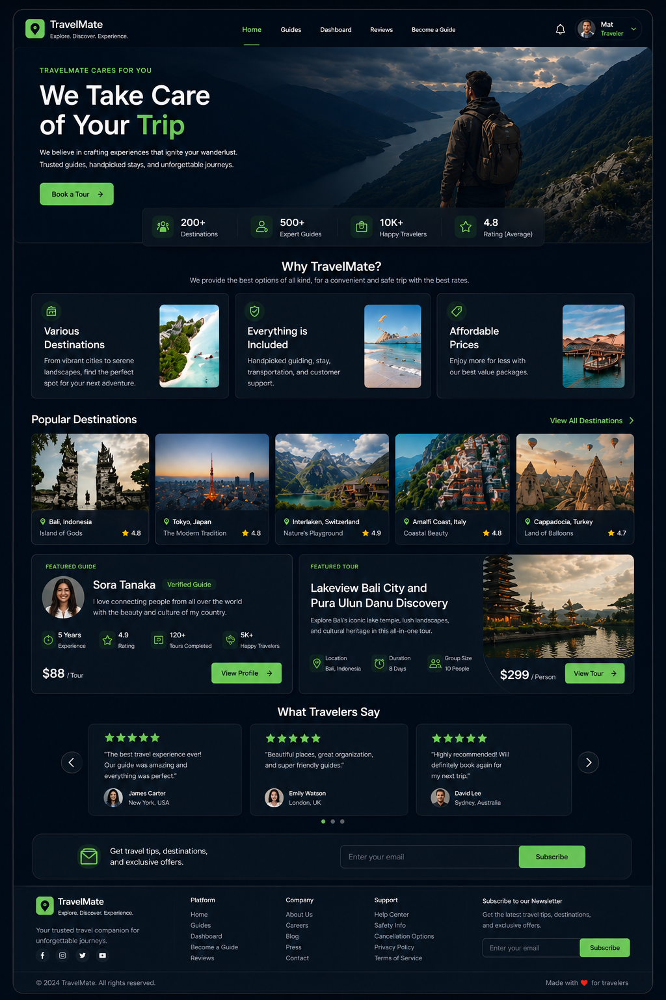
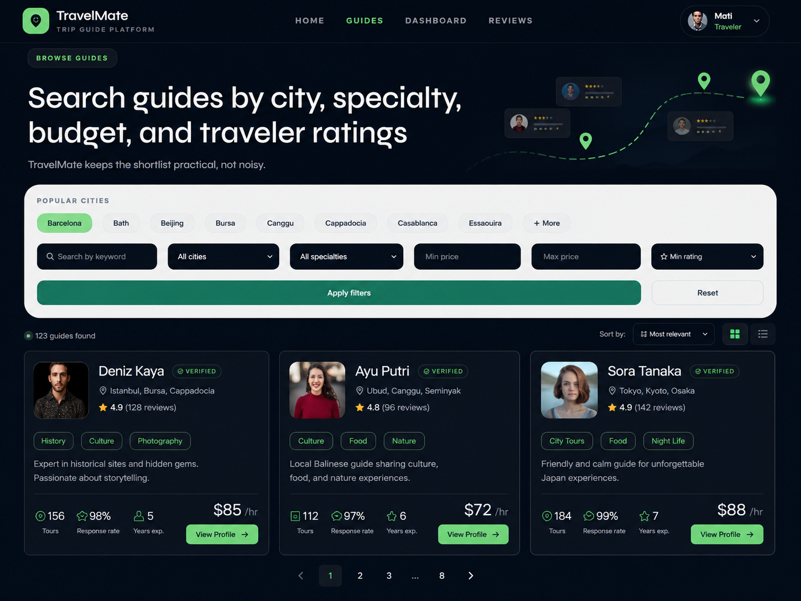
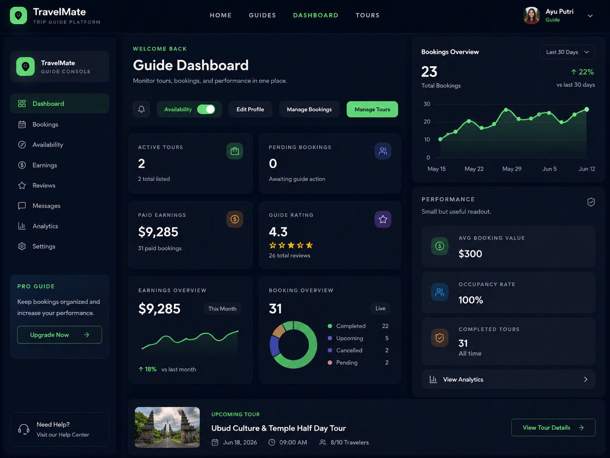
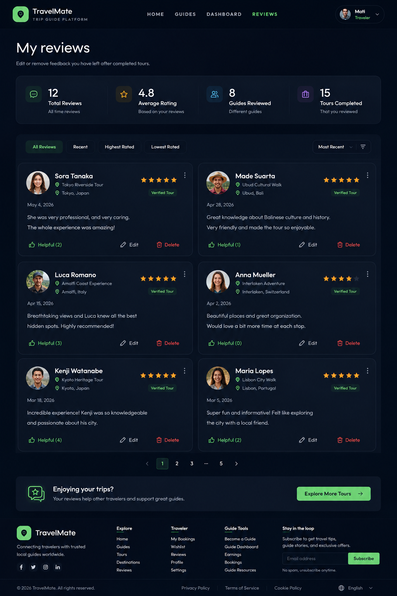

# TravelMate 🌍

TravelMate is a full-stack travel guide platform where travelers can discover local guides, book tours, manage trips, and leave reviews while guides manage profiles, bookings, tours, and earnings from their own dashboard.

Live app: https://travelmate-guide.vercel.app

## 📋 Table of Contents

1. [Features](#features)
2. [Screenshots](#screenshots)
3. [Tech Stack](#tech-stack)
4. [Setup](#setup)
5. [Environment Variables](#environment)
6. [Useful Scripts](#useful-scripts)
7. [Deployment](#deployment)
8. [Credits](#credits)

## Features

- Traveler and guides accounts
- Guide profiles with tours, bookings, and reviews
- ImageKit-powered image uploads
- Google login and email/password auth
- Admin dashboard for user and guide management

## Screenshots

### Home


### Browse Guides


### Guide Dashboard


### Reviews


## Tech Stack

- **Frontend**: React, Vite, Tailwind CSS
- **Backend**: Node.js, Express.js
- **Database**: MongoDB
- **Authentication**: JWT, Google OAuth
- **Storage**: ImageKit
- **Email**: Nodemailer

## Setup

```bash
npm run install:all
